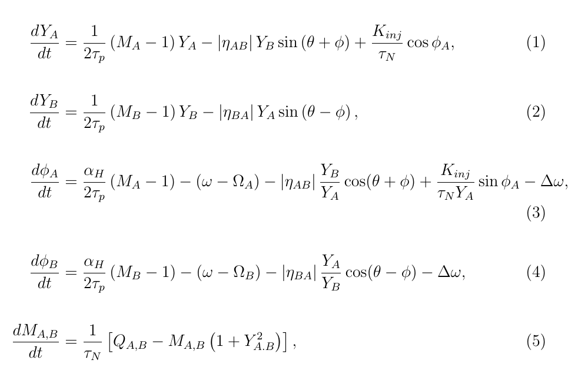

# Coupled mode lasers with injection

## Contents

+ [Overview](#Overview)
+ [Scripts](#Scripts)
   + [pulse_asym_inj](#pulse_asym_inj)
+ [Functions](#Functions)
   + [coupledInj](#coupledInj)
   + [coupledInjS](#coupledInjS)

## Overview
Matlab routines for simulating coupled mode laser dynamics with optical injection.



## Scripts

### pulse_asym_inj
Time simulation for a pulsed change in the laser parameters (originally the pumping rate).

## Functions

### coupledInj

#### Summmary
Rate equations for the coupled mode model with optical injection

#### Description

Provides the rate equations for the coupled mode model with optical
injection. The implementation is for the model given in [1], although
with the opposite sign convention taken for the phases on the optical
fields, as used in [2] for direct comparison with the model without
injection.
 
This routine is used directly by the Runge-Kutta solver (ode45) and 
indirectly (via coupledInjS) in conjunction with the nonlinear solver 
(fsolve).
  
[1] [N. Li et al, Sci Rep 8, 109 (2018)](https://doi.org/10.1038/s41598-017-18379-7)

[2] [M.J. Adams et al, Phys. Rev. A 95(5), 053869 (2017)](https://doi.org/10.1103/PhysRevA.95.053869)

#### Usage

```Matlab
    dN = coupledInj(t, N0, param);
```

#### Arguments

```
    t          An array of time steps (not used in the routine, but 
               required for Runge-Kutta implementation).

    N0         Vector of inital conditions for the equations:

    Carrier concentrations:
       MA   = N0(1)        Carrier concentration in guide A
       MB   = N0(2)        Carrier concentration in guide B
    Optical fields:
       YA   = N0(3)        Amplitude in guide A
       YB   = N0(4)        Amplitude in guide B
       phiA = N0(5)        Phase of optical field in guide A
       phiB = N0(6)        Phase of optical field in guide B

    param      a structure containing the parameters:

       param.yn        carrier recombination rate (1/tau_N)
       param.kp        cavity loss rate (1/(2*tau_p))
       param.aH        Linewidth enhancement factor
       param.kinj      Injection level rate (K_inj/tau_N)
       param.DWA       Free-running minus laser A angular frequency 
       param.DWB       Free-running minus laser B angular frequency 
       param.DWinj 	Injection detuning (W_inj - W)
       param.QA        Normalised pumping rate in guide A    
       param.QB        Normalised pumping rate in guide A 
       param.eta       Amplitude of coupling coefficient 
       param.theta     Phase of coupling coefficient 
```

#### Returns

```
    dN         An array of the derivatives of the variables in N0
```

#### Notes

[Back to top](#Coupled-mode-lasers-with-injection)


### coupledInjS

#### Summary 

Rate equations for the coupled mode model with optical injection and asymmetric coupling (no time dependence).

 
#### Description
Provides the rate equations for the coupled mode model with optical injection. The implementation is for the model given in [1], although with the opposite sign convention taken for the phases on the optical fields, as used in [2] for direct comparison with the model without injection.
   
The 'S' at the end of the function name indicates that it is used primarily for finding the steady state solutions.
   
[1] [N. Li et al, Sci Rep 8, 109 (2018)](https://doi.org/10.1038/s41598-017-18379-7)

[2] [M.J. Adams et al, Phys. Rev. A 95(5), 053869 (2017)](https://doi.org/10.1103/PhysRevA.95.053869)


#### Usage
 
```
     dN = coupledInjS(N0, param);
 
   Arguments
 
     N0         Vector of inital conditions for the equations:
 
     Carrier concentrations:
        MA   = N0(1)        Carrier concentration in guide A
        MB   = N0(2)        Carrier concentration in guide B
     Optical fields:
        YA   = N0(3)        Amplitude in guide A
        YB   = N0(4)        Amplitude in guide B
        phiA = N0(5)        Phase of optical field in guide A
        phiB = N0(6)        Phase of optical field in guide B
 
     param      a structure containing the parameters:
 
        param.yn        carrier recombination rate (1/tau_N)
        param.kp        cavity loss rate (1/(2*tau_p))
        param.aH        Linewidth enhancement factor
        param.kinj      Injection level rate (K_inj/tau_N)
        param.DWA       Free-running minus laser A angular frequency 
        param.DWB       Free-running minus laser B angular frequency 
        param.DWinj 	Injection detuning (W_inj - W)
        param.QA        Normalised pumping rate in guide A    
        param.QB        Normalised pumping rate in guide A 
        param.etaAB     Amplitude of coupling coefficient AB (asymmetric)
        param.etaBA     Amplitude of coupling coefficient BA (asymmetric) 
        param.theta     Phase of coupling coefficient 

```
 
#### Returns

``` 
     dN         An array of the derivatives of the variables in N0

```

#### Dependencies


```
    This routine calls:
 
        coupledInj(t, N, param)      - the model rate equations

```

[Back to top](#Coupled-mode-lasers-with-injection)


